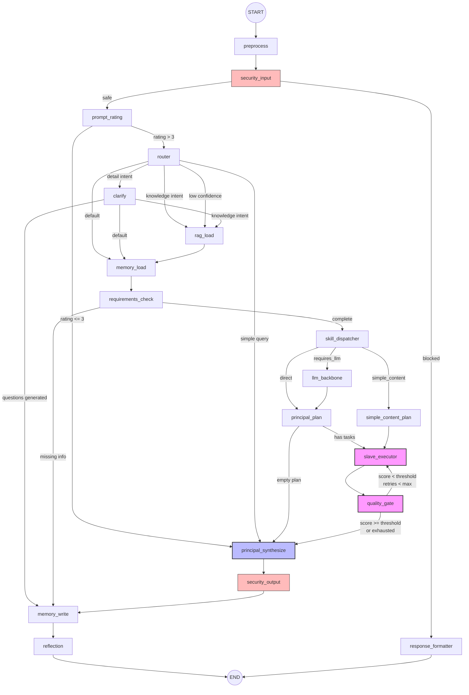
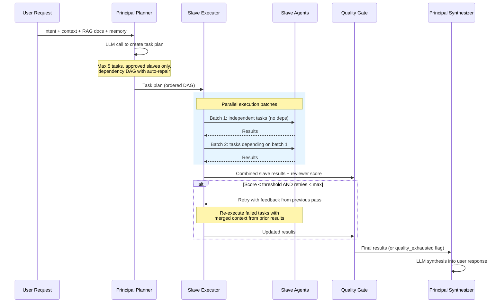

# Asuq AI

> Marketing intelligence assistant specialized for the Algerian market.

**Asuq AI** is a production-grade, multi-agent AI marketing assistant built on a **LangGraph state machine** with ~18 processing nodes, 9 domain-specific Skill agents, and 11 specialized Slave agents. It features a complete **RAG pipeline** (vector + BM25 + reranker), a **3-tier memory system** (short-term Redis, long-term Supabase/pgvector, sticky facts), **4-layer content moderation**, and **market intelligence collectors** - all tailored for Algeria's multilingual, multi-platform marketing landscape.

---

## How It Works

A user sends a marketing request (in Arabic, French, Darija, or Franco-Arab). The input is normalized and screened for prompt injection. A fast LLM rates query quality - vague queries get quick, direct answers without consuming the full pipeline. Otherwise, the router classifies intent (content creation, competitor analysis, trend monitoring, etc.) and may ask clarifying questions if details are missing. Memory and RAG context are assembled: sticky facts (brand identity, audience) are injected into every LLM call, while semantic search pulls relevant market knowledge from the vector store. A planner decomposes the task into a directed acyclic graph of slave agents (research, strategy, creation, localization, review) that execute in parallel batches via `asyncio.gather`. A quality gate scores the result and loops back for retry on failure - each intent type has its own quality threshold. The synthesized response passes output security screening, facts are persisted to the 3-tier memory system, and a reflection agent extracts lessons for future improvement.

**Key routing decisions:**

| Edge | Condition | Effect |
|------|-----------|--------|
| `security_input -> response_formatter` | Prompt injection or harmful content detected | Block with polite refusal |
| `prompt_rating -> principal_synthesize` | Rating <= 3 (vague/nonsense query) | Skip full pipeline, quick response |
| `router -> principal_synthesize` | `is_simple=True` (greeting, thanks) | Fast-path, no RAG/planner/agents |
| `router -> clarify` | Detail intent or confidence < 0.3 | Ask user for more information |
| `skill_dispatcher -> llm_backbone` | Skill returns `requires_llm=True` | Format skill output via LLM |
| `skill_dispatcher -> simple_content_plan` | Short content request, no research keywords | Pre-built 2-task plan (bypasses planner LLM) |
| `quality_gate -> slave_executor` | Reviewer score < intent-specific threshold | Retry with feedback from previous pass |
| `quality_gate -> principal_synthesize` | Score OK or max retries exhausted | Proceed (sets `quality_exhausted` flag if retried out) |

---

## Multi-Agent Execution

The planner decomposes a task into a DAG of slave agents. The executor runs each dependency level in parallel via `asyncio.gather`. The quality gate scores the combined output and loops back on failure - this self-correction mechanism is the system's key differentiator.

---

## Architecture

See [docs/architecture.md](docs/architecture.md) for the full graph state machine, node inventory, and routing decisions.

See [docs/rag-pipeline.md](docs/rag-pipeline.md) for multi-strategy retrieval details.

See [docs/moderation.md](docs/moderation.md) for the 4-layer moderation pipeline.

See [docs/darija-nlp.md](docs/darija-nlp.md) for Algerian Arabic NLP preprocessing.

See [docs/landing-pages.md](docs/landing-pages.md) for the landing page generation pipeline.

---

## Code Samples

| Sample | Description |
|--------|-------------|
| [samples/state.py](samples/state.py) | `AsuqState` TypedDict - the shared state definition (~44 fields) |
| [samples/routing_functions.py](samples/routing_functions.py) | Routing / conditional-edge functions - pure control flow, no I/O |
| [samples/slave_base.py](samples/slave_base.py) | `BaseSlave` ABC + `SlaveOutput` dataclass - the slave agent interface |

---

## Skill Agents (9)

| Skill | Purpose | requires_llm |
|-------|---------|:---:|
| `content` | Social media posts, captions, content ideas | Yes |
| `competitor` | Competitor research and market analysis | Yes |
| `ad_copy` | Ad campaigns, marketing scripts, copywriting | Yes |
| `trend_radar` | Market trends, price monitoring, news | Yes |
| `lead_magnet` | Lead generation funnels, offers, landing pages | Yes |
| `pdf` | PDF document analysis with market benchmarks | Yes |
| `web_search` | Web search with domain-specific targeting | No |
| `market_intel` | Market intelligence (runs 4 data collectors in parallel) | No |
| `landing_page` | Product landing pages with copy, layout, and palette | No |

---

## Slave Agents (11)

| Slave | Purpose | Uses LLM |
|-------|---------|:---:|
| `researcher` | Web + RAG research with tool-calling | Yes |
| `strategist` | Marketing strategy development | Yes |
| `creator` | Content creation (primary quality tier) | Yes |
| `localizer` | Cultural adaptation (Arabic/French/Darija mixing) | Yes |
| `reviewer` | Quality rubric scoring (0-10, dimension scores) | Yes |
| `searcher` | Direct web search (no LLM) | No |
| `rag_browser` | Semantic search over curated knowledge base | No |
| `requirements` | Prompt completeness analysis | Yes |
| `reflection` | Post-response quality analysis and lesson extraction | Yes |
| `security_input` | Input safety + prompt injection detection | Conditional |
| `security_output` | Output leak detection (API keys, JWTs, DB URLs) | Conditional |

---

## Quality Thresholds

| Intent | Threshold | Max Passes |
|--------|-----------|------------|
| `content` | 6.0 | 1 |
| `ad_copy` | 6.0 | 1 |
| `competitor` | 7.5 | 1 |
| `trend_radar` | 7.0 | 1 |
| `lead_magnet` | 6.5 | 1 |
| `market_intel` | 7.0 | 1 |

> All max passes are capped by the global `MAX_SELF_CORRECT_PASSES` config (currently 1).

---

## Configuration Numbers

| Setting | Value |
|---------|-------|
| `MAX_RETRIES` | 2 |
| `MAX_SELF_CORRECT_PASSES` | 1 |
| `SHORT_TERM_MEMORY_TTL` | 7200s (2h) |
| `SHORT_TERM_MEMORY_LIMIT` | 10 exchanges |
| `MAX_LONG_TERM_PER_USER` | 200 facts |
| `RAG_THRESHOLD` | 0.6 |
| `RAG_TOP_K` | 3 |
| `MODERATION_LAYER_2_THRESHOLD` | 0.7 |
| `GLOBAL_KNOWLEDGE_TTL_DAYS` | 365 |

---

## License

MIT - see [LICENSE](LICENSE).
