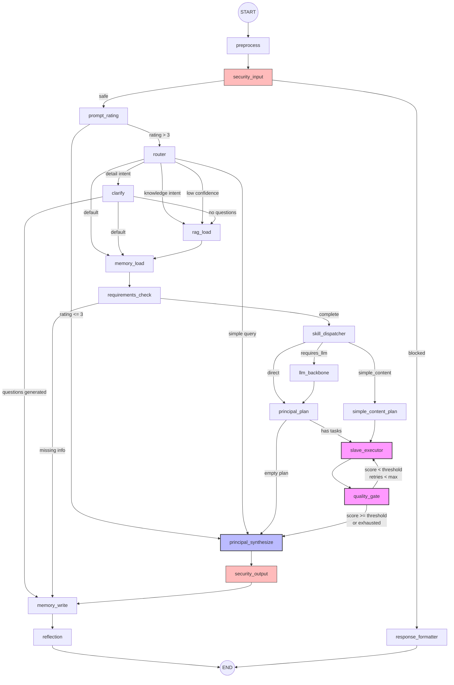

# Asuq AI

> Marketing intelligence assistant specialized for the Algerian market (ARCHITECTURE SHOWCASE).

**Asuq AI** is a multi-agent AI marketing assistant built on a **LangGraph state machine** with ~18 processing nodes, 9 domain-specific Skill agents, and 11 specialized Slave agents. It features a complete **RAG pipeline** (vector + BM25 + reranker), a **3-tier memory system** (short-term Redis, long-term Supabase/pgvector, sticky facts), **4-layer content moderation**, and **market intelligence collectors** - all tailored for Algeria's multilingual, multi-platform marketing landscape.

> **Note:** This repository is an **architecture showcase**. File contents are reference implementations and illustrative examples, not production code. Configuration values shown are representative ranges, not actual production settings.

---

## How It Works

A user sends a marketing request (in Arabic, French, Darija, or Franco-Arab). The input is normalized and screened for prompt injection. A fast LLM rates query quality — vague queries get quick, direct answers without consuming the full pipeline. Otherwise, the router classifies intent (content creation, competitor analysis, trend monitoring, etc.) and may ask clarifying questions if details are missing. Memory and RAG context are assembled: sticky facts (brand identity, audience) are injected into every LLM call, while semantic search pulls relevant market knowledge from the vector store. A planner decomposes the task into a directed acyclic graph of slave agents (research, strategy, creation, localization, review) that execute in parallel batches via `asyncio.gather`. A quality gate scores the result and loops back for retry on failure — each intent type has its own quality threshold. The synthesized response passes output security screening, facts are persisted to the 3-tier memory system, and a reflection agent extracts lessons for future improvement.

---

## Code Samples

| Sample | Description |
|--------|-------------|
| [samples/state.py](samples/state.py) | `AsuqState` TypedDict — the shared state definition |
| [samples/routing_functions.py](samples/routing_functions.py) | Routing / conditional-edge functions |
| [samples/slave_base.py](samples/slave_base.py) | `BaseSlave` ABC + `SlaveOutput` dataclass |

---

## Documentation

| Document | Description |
|----------|-------------|
| [docs/architecture.md](docs/architecture.md) | Full graph state machine, node inventory, routing |
| [docs/rag-pipeline.md](docs/rag-pipeline.md) | Multi-strategy retrieval details |
| [docs/moderation.md](docs/moderation.md) | 4-layer moderation pipeline |
| [docs/darija-nlp.md](docs/darija-nlp.md) | Algerian Arabic NLP preprocessing |
| [docs/landing-pages.md](docs/landing-pages.md) | Landing page generation pipeline |

---

## License

MIT — see [LICENSE](LICENSE).
