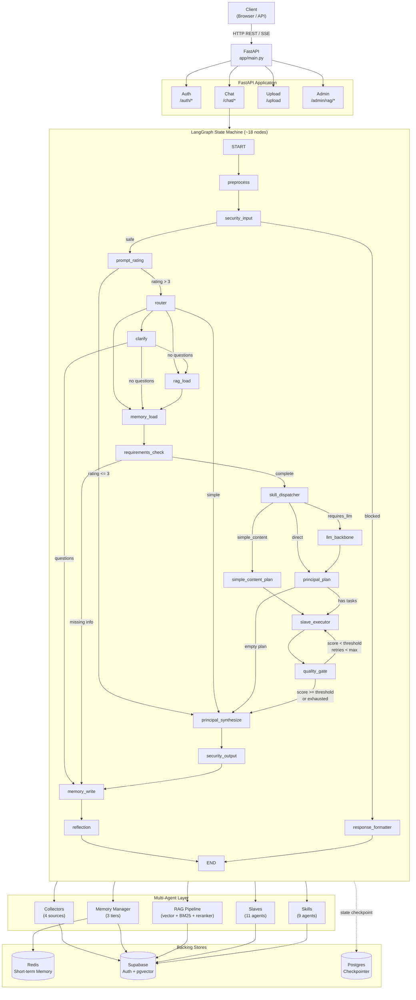
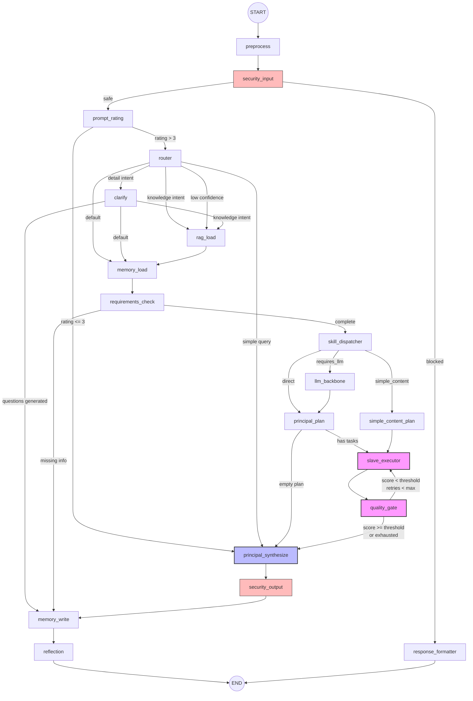
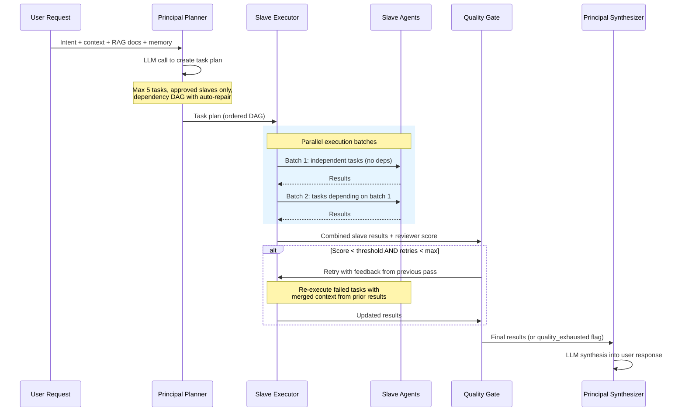

# Architecture

Asuq AI is a multi-agent marketing assistant built on a LangGraph state machine with ~18 processing nodes, 9 domain skills, and 11 specialized slave agents.

## High-Level Design

## Graph State Machine

Every request traverses up to 18 nodes. Conditional edges route around unnecessary work: low-quality prompts skip the planner, simple greetings bypass RAG and the multi-agent pipeline entirely, and the quality gate loops back for retry when output falls short.

### Node Inventory

| Node | File | Purpose |
|------|------|---------|
| `preprocess` | `preprocess.py` | Classify script type (Arabic/Franco/French/English) + normalize input |
| `security_input` | `security_input_node.py` | Input injection detection (regex + LLM) |
| `prompt_rating` | `prompt_rating.py` | Rate query quality 1-5; low-quality skips full pipeline |
| `router` | `router.py` | Intent classification + skill selection |
| `clarify` | `clarify.py` | Generate clarifying questions for detail-needing intents |
| `rag_load` | `rag_load.py` | Multi-strategy RAG retrieval |
| `memory_load` | `memory_load.py` | Load short-term + long-term user memory |
| `requirements_check` | `requirements_check.py` | Check prompt completeness |
| `skill_dispatcher` | `skill_dispatcher.py` | Route to matched skill agent |
| `llm_backbone` | `llm_backbone.py` | Format skill output through LLM when needed |
| `simple_content_plan` | *(inline)* | Pre-built 2-task plan for simple content requests |
| `principal_plan` | `principal_plan.py` | Create multi-agent task plan |
| `slave_executor` | `slave_executor.py` | Execute slaves in parallel with dependency batching |
| `quality_gate` | `quality_gate.py` | Intent-aware quality threshold check + retry routing |
| `principal_synthesize` | `principal_synthesize.py` | Synthesize all slave outputs into final response |
| `security_output` | `security_output_node.py` | Output leak detection (API keys, credentials) |
| `memory_write` | `memory_write.py` | Store to short-term + long-term memory |
| `reflection` | `reflection_node.py` | Post-response quality analysis + lesson extraction |
| `response_formatter` | `response_formatter.py` | Format final output + handle errors |

### Flow

### Key Routing Decisions

| Edge | Condition | Effect |
|------|-----------|--------|
| `security_input -> response_formatter` | Prompt injection or harmful content detected | Block with polite refusal |
| `prompt_rating -> principal_synthesize` | Rating <= 3 (vague/nonsense query) | Skip full pipeline, quick response |
| `router -> principal_synthesize` | `is_simple=True` (greeting, thanks) | Fast-path, no RAG/planner/agents |
| `router -> clarify` | Detail intent or confidence < 0.3 | Ask user for more information |
| `skill_dispatcher -> llm_backbone` | Skill returns `requires_llm=True` | Format skill output via LLM |
| `skill_dispatcher -> simple_content_plan` | Short content request, no research keywords | Pre-built 2-task plan (bypasses planner LLM) |
| `quality_gate -> slave_executor` | Reviewer score < intent-specific threshold | Retry with feedback from previous pass |
| `quality_gate -> principal_synthesize` | Score OK or max retries exhausted | Proceed (sets `quality_exhausted` flag if retried out) |

## Self-Correction Loop

The quality gate implements an intent-aware self-correction mechanism:

| Intent | Quality Threshold | Max Passes (capped by global config) |
|--------|-------------------|--------------------------------------|
| `content` | 6.0 | 1 |
| `ad_copy` | 6.0 | 1 |
| `competitor` | 7.5 | 1 |
| `trend_radar` | 7.0 | 1 |
| `lead_magnet` | 6.5 | 1 |
| `market_intel` | 7.0 | 1 |
| *(default)* | 7.0 | 1 |

> All intent-specific max passes are capped by the global `MAX_SELF_CORRECT_PASSES` setting (currently 1), so the effective max is always 1 pass regardless of intent.

When the reviewer score falls below the threshold, the gate routes back to `slave_executor` with feedback. On exhaustion, the `quality_exhausted` flag is set and synthesis proceeds with a quality warning.

## Multi-Agent Execution

The planner decomposes a task into a DAG of slave agents (max 5 tasks). The executor runs each dependency level in parallel via `asyncio.gather`. The quality gate scores the combined output and loops back on failure - this self-correction mechanism is the system's key differentiator.

## Error Handling

Any node that encounters an error sets `state["error"]` and routes directly to `response_formatter`, which returns the error to the user. The graph never crashes from a single node failure.

## Configuration Numbers

| Setting | Value | Source |
|---------|-------|--------|
| `MAX_RETRIES` | 2 | `app/config.py` |
| `MAX_SELF_CORRECT_PASSES` | 1 | `app/config.py` |
| `SHORT_TERM_MEMORY_TTL` | 7200s (2h) | `app/config.py` |
| `SHORT_TERM_MEMORY_LIMIT` | 10 | `app/config.py` |
| `MAX_LONG_TERM_PER_USER` | 200 | `app/config.py` |
| `RAG_THRESHOLD` | 0.6 | `app/config.py` |
| `RAG_TOP_K` | 3 | `app/config.py` |
| `MODERATION_LAYER_2_THRESHOLD` | 0.7 | `app/config.py` |
| `GLOBAL_KNOWLEDGE_TTL_DAYS` | 365 | `app/config.py` |
| `KNOWLEDGE_SWEEP_INTERVAL_HOURS` | 6 | `app/config.py` |
