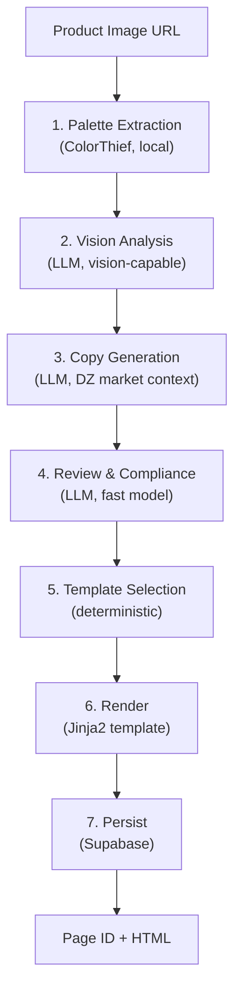

# Landing Pages

The landing page skill generates product landing pages with copy, layout, and palette - tailored for the Algerian market.

## Pipeline

The landing page pipeline runs 3 LLM passes plus local processing:

## Passes (in order)

| Pass | Model | Purpose |
|------|-------|---------|
| **Vision** | Vision-capable model | Extract product facts from image |
| **Copy** | Primary model + DZ context | Generate landing page copy |
| **Review** | Fast model | Compliance & quality check |

## Template Selection

| Style | Template |
|-------|----------|
| `minimalist` | minimalist |
| `tech` | minimalist |
| `luxury` | luxury |
| *(other)* | default |

## Output

Returns `SkillOutput` with:
- `result`: `{page_id, html, template_id}`
- `metadata`: `{vision, copy, palette}`
- `requires_llm`: `False` (all LLM work done internally)
