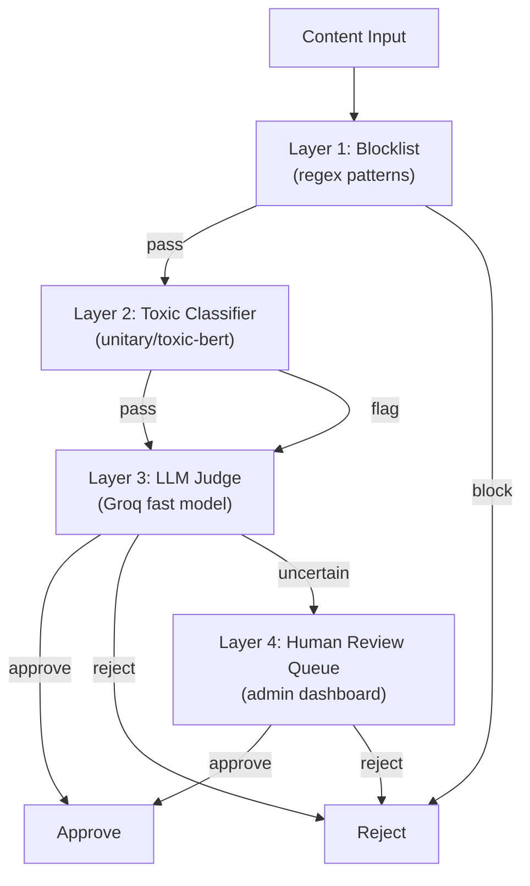

# Moderation Pipeline

4-layer content moderation defined in `app/moderation/pipeline.py`.

## Architecture



## Layers

| Layer | Technology | Notes |
|-------|-----------|-------|
| **L1 - Blocklist** | Regex patterns | Configurable via `MODERATION_BLOCKLIST` |
| **L2 - Toxic Classifier** | Classification model | Optional, runs locally |
| **L3 - LLM Judge** | Fast LLM | Evaluates hate, misinformation, spam, PII |
| **L4 - AI Gate** | SecurityInput/OutputSlaves | Regex fast-path + LLM deep check |

## Actions

| Action | Behavior |
|--------|----------|
| `approve` | Content proceeds |
| `reject` | Content blocked with reason |
| `queue` | Inserted into `moderation_queue` table for manual admin review |

## Moderation Result Structure

```json
{
  "status": "approved" | "rejected" | "queued",
  "reasons": [],
  "layer_1_result": {"blocked": false, "matched_patterns": []},
  "layer_2_result": {"toxic_score": 0.02, "flagged": false},
  "layer_3_result": {"judge_verdict": "approve", "reasoning": "..."}
}
```

## Security Gates (Graph-Level)

In addition to the moderation pipeline, the graph has two security nodes. Both are **fail-closed**:
on any internal error (timeout, model unavailable, unexpected exception) they return `safe: False`
to block the request rather than allowing it through. The error is always logged.

### Input Gate (`security_input_node.py`)
- Runs on every user message before any processing
- Regex patterns for 13+ injection/attack categories
- LLM verification for sophisticated attacks
- Localized refusal messages in 4 registers

### Output Gate (`security_output_node.py`)
- Runs on every assistant response before sending to user
- 13 regex patterns: API keys, JWT tokens, credentials, phone numbers
- LLM verification for contextual leaks
- Replaces blocked content with generic message

## Configuration

| Setting | Default | Purpose |
|---------|---------|---------|
| `MODERATION_ENABLED` | `true` | Enable moderation pipeline |
| `MODERATION_BLOCKLIST` | configurable | Regex patterns for Layer 1 |
| `MODERATION_LAYER_2_THRESHOLD` | configurable | Toxicity classifier threshold |
