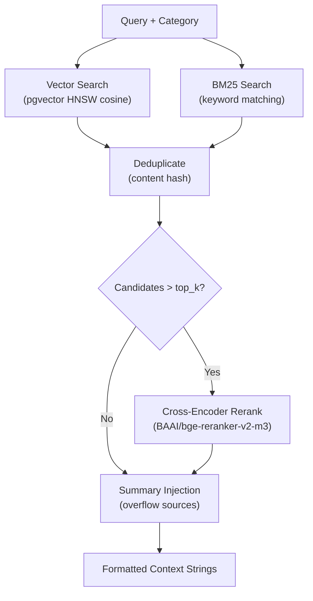

# RAG Pipeline

Multi-strategy retrieval with deduplication and reranking, defined in `app/rag/pipeline.py`.

## Overview

## Strategies

| Strategy | Module | Description |
|----------|--------|-------------|
| **Vector** | `strategies/similarity.py` | pgvector cosine search (top-20), auto-detects v1 (768d) vs v2 (1024d) columns |
| **BM25** | `strategies/bm25.py` | Keyword extraction + row scoring by match count (top-10) |
| **Rerank** | `strategies/reranker.py` | `BAAI/bge-reranker-v2-m3` CrossEncoder, runs when candidates exceed `top_k` |

## Embedding Provider

`app/rag/embeddings.py` implements a 3-model fallback chain:

1. **Primary:** Primary embedding model (e.g., multilingual MPNet, 768d)
2. **Fallback 1:** Secondary model (e.g., E5-large, 1024d)
3. **Fallback 2:** Lightweight fallback (e.g., BGE-small, 384d)
4. **Final fallback:** SHA-256 hash-based deterministic vectors (no model load)

Models are lazy-loaded only if cached locally. Thread-safe via `ThreadPoolExecutor(max_workers=4)`.

## Vector Search Functions (PostgreSQL)

| Function | Purpose |
|----------|---------|
| `match_memories()` | Semantic search over long-term user memories |
| `match_knowledge()` | Semantic search over knowledge base |
| `match_knowledge_v2()` | Same but on higher-dimension embeddings |

Indexes: HNSW on embedding columns using `vector_cosine_ops`.

## Configuration

| Setting | Default (illustrative) | Purpose |
|---------|----------------------|---------|
| `RAG_STRATEGIES` | `vector,bm25,rerank` | Active retrieval strategies |
| `RAG_THRESHOLD` | configurable (~0.6) | Vector similarity threshold |
| `RAG_TOP_K` | configurable (~3–5) | Max documents retrieved |
| `RAG_RERANK_CANDIDATES` | configurable (~20) | Candidates fed to reranker |
| `RAG_CROSS_ENCODER` | cross-encoder model | Reranker model |
| `EMBEDDING_MODEL` | primary embedding model | Primary embedding model |
| `EMBEDDING_DIMS` | model-dependent (e.g., 768) | Primary embedding dimensions |
| `EMBEDDING_V2_DIMS` | model-dependent (e.g., 1024) | V2 embedding dimensions |
